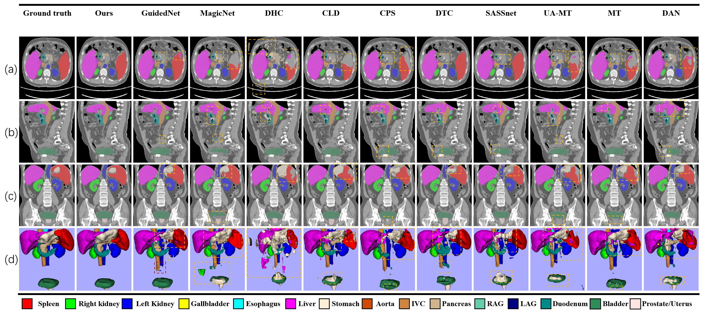

# paper name: Rethinking Co-training for Semi-Supervised Multi-Organ Segmentation

## After preprocess datasets URL:
[FLARE22 and AMOS22 dataset in paper experiments](https://pan.baidu.com/s/1_1wLTEnDLPcstaCG4rLg6A?pwd=hias)

## Our checkpoints for our model URL:
[FLARE22 checkpoint](https://pan.baidu.com/s/1hRg29_Ya_yY0HwpsgYN6Dw?pwd=hias)

[AMOS22 checkpoint](https://pan.baidu.com/s/1etorr7LTEGon4CykPHz-QA?pwd=hias)

And we just need the keywords 'model' or 'model_ema', the others is not needed for inference.

> Here we want to classify something about a picture in this paper.

> If you have read our paper, you may find the AMOS22 results visualization with error to class name.

> Now, we give a correct picture to show it clearly and we are so sorry to it because the camera ready is out of time.

